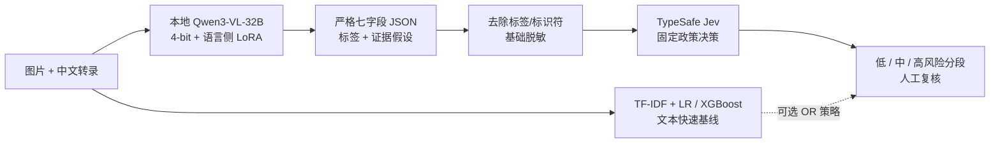

# Social Risk · Qwen3-VL + Jev

中文社交平台图文内容风险识别：从数据治理、传统基线、Qwen3-VL 垂域 LoRA，到结构化证据与 TypeSafe Jev 决策的可审计实验项目。

[English](README.en.md) · [架构](docs/ARCHITECTURE.md) · [全部开发实验](docs/VALIDATION_RESULTS.md) · [复现](docs/REPRODUCIBILITY.md) · [模型卡](docs/MODEL_CARD.md) · [成本与速度](docs/LATENCY_COST.md)

> 状态：实验阶段暂时结束，整理为研究项目。原创代码与文档采用 [MIT 许可证](LICENSE)。这里公开代码、配置与汇总结果，不公开数据集图片/文本、逐条预测、模型权重、私人审核记录或 API 密钥。不是自动删帖系统，也不是通用风控产品；数据、模型和 API 各有独立条款。

## 最终冻结测试排行榜

**170 条，123 条非厌女 / 47 条厌女；按 Macro-F1 从高到低排序。** 所有方法使用同一测试划分；阈值与主方案在测试前冻结。正类“有害”在此特指数据集的 Misogyny 标签，不代表全部内容风险。

| 排名 | 方法 | Macro-F1 | 准确率 | 有害精确率 | 有害召回率 | FP | FN |
|---:|---|---:|---:|---:|---:|---:|---:|
| 1 | TF-IDF＋Logistic Regression（C=4） | 90.36% | 92.94% | 100.00% | 74.47% | 0 | 12 |
| 2 | TF-IDF＋Logistic Regression（C=1） | 89.80% | 92.35% | 94.74% | 76.60% | 2 | 11 |
| 3 | TF-IDF＋XGBoost（depth=4） | 89.10% | 91.76% | 92.31% | 76.60% | 3 | 11 |
| 4 | 文本基线 OR LoRA Qwen（图像＋文本） | 88.80% | 90.59% | 78.18% | 91.49% | 12 | 4 |
| 5 | TF-IDF＋XGBoost（depth=2） | 88.24% | 91.18% | 92.11% | 74.47% | 3 | 12 |
| 6 | 文本基线 OR 未微调 Qwen（图像＋文本） | 87.89% | 90.00% | 78.85% | 87.23% | 11 | 6 |
| 7 | 文本基线 OR 多模态＋Jev（t=0.40，预先冻结主方案） | 87.25% | 89.41% | 77.36% | 87.23% | 12 | 6 |
| 8 | LoRA Qwen3-VL-32B（图像＋文本） | 82.36% | 85.88% | 74.47% | 74.47% | 12 | 12 |
| 9 | LoRA Qwen证据＋Jev（t=0.40，非纯Jev） | 79.74% | 84.12% | 72.73% | 68.09% | 12 | 15 |
| 10 | LoRA Qwen证据＋Jev（t=0.50固定对照，非纯Jev） | 76.65% | 82.35% | 71.79% | 59.57% | 11 | 19 |
| 11 | 未微调 Qwen3-VL-32B（图像＋文本） | 76.65% | 82.35% | 71.79% | 59.57% | 11 | 19 |

这里的“文本 OR”是两路任一路报阳性即报阳性，不是坐标/分数平均，也不是联合训练。Jev 表项读取的是 Qwen 图文证据，**不是纯 Jev 文本基线**。纯 Jev 的配对对照只在验证集做过，不虚构测试成绩。

以上是实际实验日志中的汇总混淆矩阵；公开仓库可重算指标，但本次工程整理没有重新执行 GPU 或云端评测。详细协议见 [评估说明](docs/EVALUATION.md)，完整 38 项开发方法/阈值对照见 [验证集排行榜](docs/VALIDATION_RESULTS.md)。5/16/20 条 smoke 与私人 review23 单列，不当作全量成绩。

## 结论：效果、召回与成本的取舍

- **最高测试 Macro-F1 / 准确率：** TF-IDF + Logistic Regression C=4，90.36% / 92.94%。本数据上的文本特征很强；不能据此宣称多模态大模型普遍优于传统方法。
- **最高测试有害召回：** 文本 OR LoRA Qwen，91.49%，相对文本 C=4 少漏掉 8 条，但增加 12 条误报。适合讨论“提高发现率、增加人工复核成本”的业务取舍。
- **垂域微调有效：** 同一测试七字段流程，Base → LoRA 的 Macro-F1 为 76.65% → 82.36%，召回为 59.57% → 74.47%。
- **多模态证据对 Jev 有帮助：** 验证集固定政策、t=0.40 时，纯文本 Jev Macro-F1 69.42%，LoRA 图文证据 + Jev 84.25%。这同时加入 Qwen 语义处理，不能归因为“仅图片”的因果增益。
- **Jev 不是无条件增益：** 预先指定的“文本 OR 多模态 + Jev”主方案在测试上 Macro-F1 87.25%，低于文本 C=4。保留负面结果与开发—测试落差，不把验证集 94.97% 包装成最终测试成绩。

小测试集、预训练数据潜在重叠、阈值选择和来源差异都会影响泛化；当前结果不是 SOTA 声明。更多解释见 [实验记录](docs/EXPERIMENTS.md)。

## 模型与业务架构



Qwen 在本地接收图像与文本；只训练语言注意力 LoRA，视觉编码器冻结。Jev 是独立托管服务，不属于本地 Qwen 权重；本项目没有训练 Jev。下游只发送转录与六个证据字段，不发送图片、真实标签、Qwen 最终标签或样本路径。

风险区间为低 [0,0.2)、中 [0.2,0.8)、高 [0.8,1]，**这是操作性分段，不是经校准的真实风险概率**；分类阈值 t=0.40 与分段是不同概念。无效/不确定输出需复核，不能默认为安全。基础脱敏不保证移除全部个人信息。

## 三分钟离线体验

Python 3.12+，在项目根目录执行：

```bash
python -m venv .venv
# Linux / AutoDL：
source .venv/bin/activate
# Windows PowerShell 用：.\.venv\Scripts\Activate.ps1

python -m pip install -e .
social-risk results --split test
social-risk results --split validation
social-risk demo
```

这些公共命令不读 API 密钥、不调用网络/API、不加载模型，也不需要 GPU。`demo` 使用**完全合成内容与预设分数**，只演示数据流，不是实时模型预测或准确率测试。

真正复跑数据准备、基线和 GPU 实验请看 [复现指南](docs/REPRODUCIBILITY.md)。不要把离线演示误认为“已部署线上服务”。

## 数据与微调配置

| 项目 | 实验设置 |
|---|---|
| 数据集 | LT-EDI 中文厌女 meme 数据，图像 + 中文转录 + 二分类标签 |
| 原始来源 | [Mysogyny-Meme-Detection](https://github.com/AJFaisal002/Mysogyny-Meme-Detection)，固定 commit 0179687f197a0b2babddcb4eb32547a07cba0933 |
| 分组划分 | train 978 / val 172 / test 170，train/val/test 重复候选组不交叉 |
| 质量治理 | 1 条多帧图片隔离；39 条去重/跨划分防泄漏隔离；原始文件不改动 |
| 基座 | Qwen3-VL-32B-Instruct，bitsandbytes 4-bit；不沿用竞赛适配器 |
| LoRA | 语言注意力 q/k/v/o，rank=8，alpha=16，dropout=0.05；视觉冻结 |
| 训练 | 1 epoch，245 优化步，微批 1，梯度累积 4；约 1992 万可训练参数 |
| 学习率 | 1e-5 → 1e-6，12 步 warmup 后余弦衰减；梯度裁剪 1.0 |
| 监督目标 | 短 JSON 二分类标签；没有人工七字段解释监督，也没有 DPO |
| GPU | 单张 RTX PRO 6000 Blackwell 96GB（实验环境，不是离线体验要求） |

原始 dev 170 条被预留作本项目测试集，**不是宣称拿到独立官方隐藏测试集**。政治内容仅有用户抽查，没有全量无政治内容证明。标签也不包含真实“低/中/高风险程度”标注。见 [数据卡](docs/DATA_CARD.md) 与 [模型卡](docs/MODEL_CARD.md)。

## 工程结构

```text
social-risk-qwen-jev/
├── src/social_risk_jev/       # 可安装的轻量公共模块
│   ├── perception/           # 七字段类型约束与一致性提示
│   ├── decision/             # Jev 请求构建、阈值/分段、复核策略
│   ├── evaluation/           # 指标重算与排行榜
│   ├── resources/            # 聚合矩阵与合成离线示例
│   ├── privacy.py            # 基础脱敏（非完整匿名化）
│   └── cli.py                # 不会默认调用云端的公共入口
├── experiments/v1/
│   ├── src/                  # 实际运行过的原始脚本，逐字节保留
│   ├── tests/                # 对应的 mock/合成回归测试
│   └── source_manifest.json  # 历史源码 SHA-256
├── configs/                  # 已用配置快照，不伪装自动执行配置
├── scripts/                  # 测试、发布检查、显式实验启动器
├── tests/                    # 公共接口与结果一致性测试
├── docs/                     # 架构/数据/模型/评估/成本/复现/项目叙述
├── requirements/             # CPU 依赖与已观察 GPU 环境
└── .github/workflows/        # 离线 CI，不配置 API 密钥
```

公共模块负责稳定接口；历史脚本负责真实实验流程。两者刻意分开，避免整理目录时破坏既有导入与哈希审计链。新的工程入口不会假装历史脚本已经全部改成可移植生产服务。

## 测试与发布检查

```bash
python -m pip install -e ".[cpu]"
python scripts/run_tests.py
python scripts/check_publication.py --require-license
python scripts/run_experiment.py list
```

回归测试使用临时合成数据与模拟模型/API，不发实际云端请求，不跑真实 GPU 训练。发布检查拦截私有数据、权重、疑似密钥与异常大文件，但不是完整的安全保证；发布前需检查 staged 文件并使用 `--require-license`。

## 文档导航

| 文档 | 内容 |
|---|---|
| [验证集全部方法](docs/VALIDATION_RESULTS.md) | 38 项开发成绩、短标签/七字段区别、smoke 与未完成实验 |
| [架构](docs/ARCHITECTURE.md) | 感知—证据—政策—人工复核的数据流与模块边界 |
| [复现指南](docs/REPRODUCIBILITY.md) | 离线指标复现、CPU/GPU/云端要求与历史脚本限制 |
| [评估协议](docs/EVALUATION.md) | 冻结测试、配对比较、置信区间和失败计数 |
| [数据卡](docs/DATA_CARD.md) / [模型卡](docs/MODEL_CARD.md) | 数据治理、监督范围、训练配置及适用限制 |
| [速度与成本](docs/LATENCY_COST.md) | CPU 与 GPU/API 的不同计时范围，费用不是账单上限 |
| [实验历程](docs/EXPERIMENTS.md) | 已完成、仅诊断、讨论但未实现的方法 |
| [项目叙述](docs/PROJECT_STORY.md) | 面试中能被实验支撑的表述与业务取舍 |
| [安全](SECURITY.md) / [贡献](CONTRIBUTING.md) | 隐私、云端授权、复现与修改规范 |
| [整理验收](docs/VERIFICATION.md) | 本地测试、构建、发布检查与尚未完成的条件 |
| [许可说明](docs/LICENSING.md) / [发布](docs/PUBLISHING.md) | 权利边界与 GitHub 发布流程 |

## 后续方向（尚未完成）

证据真实性标注、训练集内的困难样本挖掘、七字段 SFT、视觉/语言联合 LoRA、训练数据独立偏好对的 DPO、外部时间切分评测、分数校准与高召回低误报级联。需重新划出未接触的测试集，不能继续用已分析的 170 条调参后声称独立验证。

## 致谢与权利边界

数据集来自上游研究项目，基座来自 Qwen，决策 API 来自 TypeSafe。[Jev 官方文档](https://docs.typesafe.ai/models) 描述的是文本/结构化状态决策接口；本仓库不声称 TypeSafe 属于 OpenAI。所有第三方数据、模型与服务条款应由使用者分别确认。作者：**TianJinWeiBoss520**。
