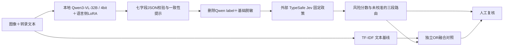

# 架构与模块边界

## 已实际实现的部分

| 责任 | 公开模块 | 实验实现 |
|---|---|---|
| 数据获取、可读性、去重与分组 | 复现文档与实验入口 | download/audit/prepare脚本 |
| 本地Qwen图文推理与语言侧LoRA | `perception/schema.py`严格输出接口 | v1 evaluate/LoRA/evidence脚本 |
| 证据语法校验、非自动一致性筛查 | `perception/schema.py` | 7字段解析与修复重试 |
| 基础脱敏、排除label/ID/图片 | `privacy.py`, `decision/policy.py` | v1 request preparation |
| 固定Jev政策与账本化API试验 | `decision/policy.py` | v1 cloud20/cloud152/test/ablation |
| 三段分数路由与人工复核 | `decision/rules.py` | 报告中的分数段分析 |
| 聚合评测、排行榜 | `evaluation/` | 冻结评测与bootstrap脚本 |

公共包是轻量接口、规则与结果工具；完整GPU和云端实验代码保留在v1归档，并非新实现了一个线上高并发服务。`social-risk demo` 仅用合成缓存展示接口，不产生真实感知输出。

## 证据契约

Qwen本地输出：`label`, `gender_targeted`, `attack_present`, `stance`, `image_role`, `needs_review`, `evidence`。

送给Jev的假设中删除 `label`，只保留后六字段；转录与解释做基础脱敏。这些假设不是人工确认事实。schema通过率衡量格式，不衡量解释真实性。

`stance` 的支持、反对、中性转述与不确定要和解释一致；女性出现、说话者为女性、粉色角色、普通粗口都不能机械推出针对女性的攻击。字段筛查只提出复核提示，不修改标签。

## 决策不是模型微调

Jev接受文本/JSON，不直接看图。本项目不对Jev权重微调；通过policy questions定义规则。Qwen的LoRA只监督二值label，并未直接监督解释或七字段事实。见[官方接口和模型说明](https://docs.typesafe.ai/models)。

## 成本设计与已测边界

本地感知是主要耗时项，历史Jev往返约1秒级。TF-IDF可作为便宜的召回分支，但测试中的级联节省是缓存模拟，不是上线吞吐量。多问题分解、证据SFT、DPO、量化部署优化和并发服务是后续方向，不作为本次已完成成果。
